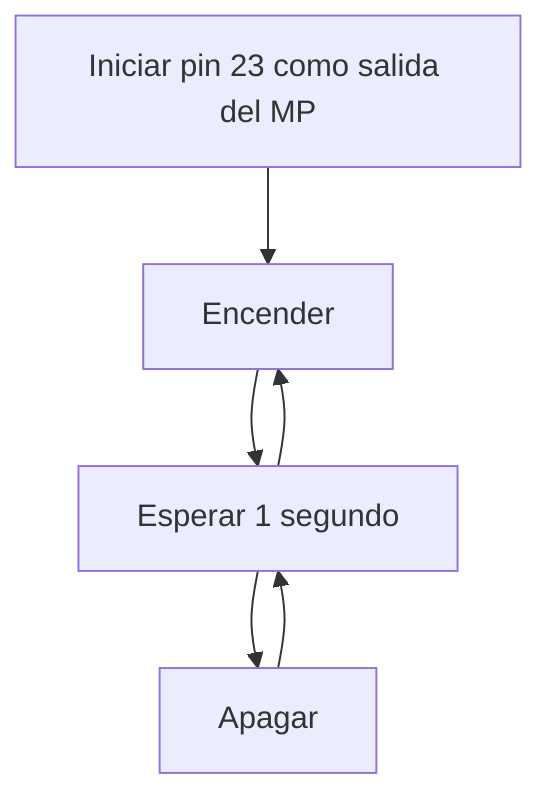

# PRACTICA 1 ············································ Pablo Pérez

## OBJETIVOS

1. **Generar el programa y subir el código al GitHub de cada uno.**
2. **Modificar el programa para que incluya el envío de datos (ON y OFF) al puerto serie. Añadir la inicialización del puerto serie y el envío cada vez que cambia el estado del LED.**
    - Iniciar pin de LED como salida.
    - Iniciar el terminal serie.
    - Bucle infinito:
        - Encender LED.
        - Sacar por puerto serie mensaje ON.
        - Espera de 1000 milisegundos.
        - Apagar LED.
        - Sacar por puerto serie mensaje OFF.
        - Espera de 1000 milisegundos.

### CODIGO:
```cpp
#include <Arduino.h>

#define LED_BUILTIN 23


void setup() {
pinMode(LED_BUILTIN, OUTPUT);
Serial.begin(115200);
}

void loop() {
  
Serial.println("ledhigh");
digitalWrite(LED_BUILTIN, HIGH);

Serial.println("ledlow");
digitalWrite(LED_BUILTIN, LOW);

}

```
# Medición de Frecuencia de Encendido y Apagado sin Delays

Eliminar los delay modificar el pin de salida a uno cualquiera de los que estan disponibles i medir con
el osciloscopio cual es la màxima frecuencia de apagado encendido que permite el microcontrolador.

Medir la frecuencia en estos cuatro casos:

- Con el envio por el puerto série del mensaje i utilizando las funciones de Arduino

- Con el envio por el puerto série y accedirendo directamente a los registros

- Sin el envio por el puerto série del mensaje i utilizando las funciones de Arduino

- Sin el envio por el puerto série y accedirendo directamente a los registros

---
 **Con Envío por Puerto Serie Utilizando Funciones de Arduino**

``` cpp
  void loop() {
     digitalWrite(led, HIGH);
     Serial.println("ON"); 
     digitalWrite(led, LOW);
     Serial.println("OFF"); 
    }

  ```

 - Frecuencia (delay: 0,5ms) --> 930Hz

2. **Con Envío por Puerto Serie Accediendo Directamente a los Registros**

``` cpp
  uint32_t *gpio_out = (uint32_t *)GPIO_OUT_REG;
  
  void loop() {
     Serial.println("ON");
     *gpio_out |= (1 << led);
     Serial.println("OFF");      
     *gpio_out ^= (1 << led);
    }

  ```

 - Frecuencia (delay: 0,5ms) --> 930Hz
 
3. **Sin Envío por Puerto Serie Utilizando Funciones de Arduino**

``` cpp
  void loop() {
     digitalWrite(led, HIGH);   
     digitalWrite(led, LOW);    
    }

  ```

 Frecuencia (delay: 0,5ms) --> 930Hz

4. **Sin Envío por Puerto Serie Accediendo Directamente a los Registros**

``` cpp
  uint32_t *gpio_out = (uint32_t *)GPIO_OUT_REG;

  void loop() {
     *gpio_out |= (1 << led);
     *gpio_out ^= (1 << led);
    }

  ```
 Frecuencia (delay: 0,5ms) --> 930Hz

# DIAGRAMA DE FLUJO


